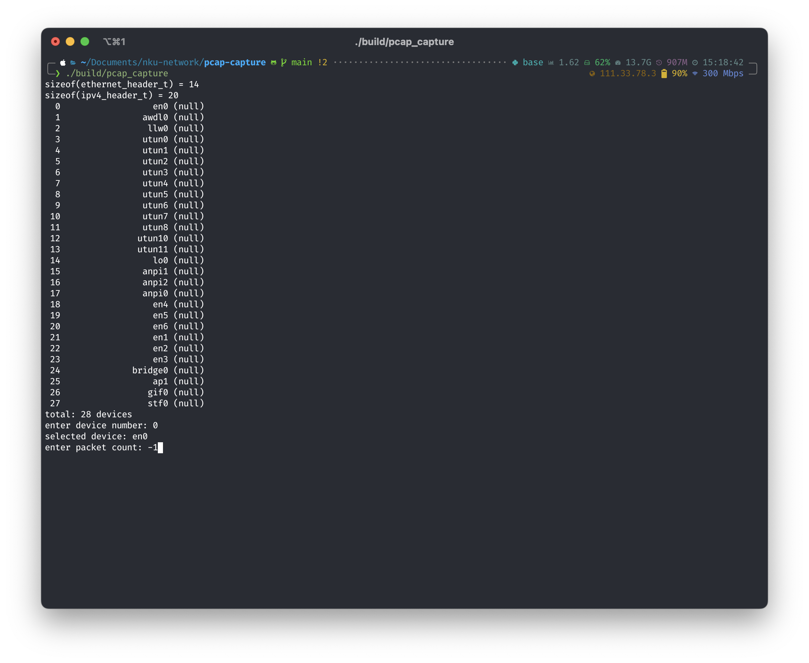
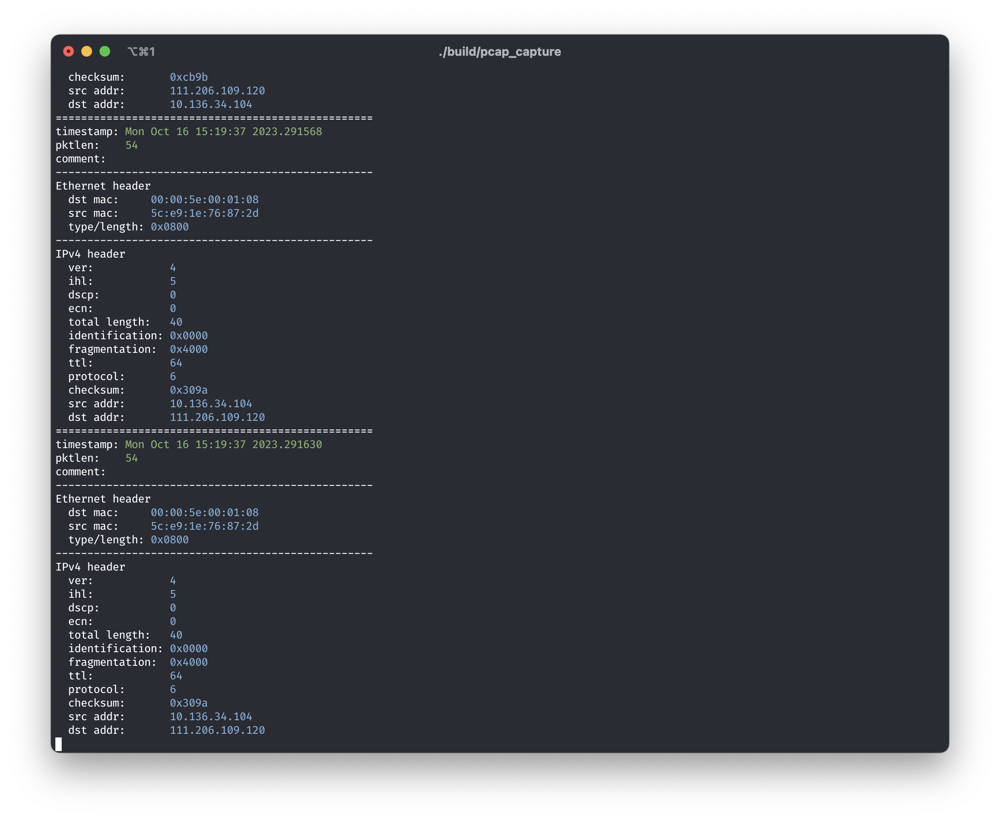

# 实验二：数据包捕获与分析

## 前期准备

使用 macOS 作为数据包捕获和分析的实验环境，使用 libpcap 替代 npcap。

使用 Homebrew 安装 libpcap：

```shell
brew install libpcap
```

## libpcap 的使用

### libpcap 架构

libpcap 是一个用于捕获网络数据库的 C/C++ 库。在使用 libpcap 进行编程时可以将其当作网络设备驱动程序和编写的用户程序的中间层进行使用。

libpcap 提供了一系列用于交互的接口并且隐藏了底层驱动程序的复杂细节。使用 libpcap 可以打开网络设备，并且直接对数据包进行捕获。

### 设备列表的获取

使用 `pcap_findalldevs()` 接口获取设备列表，并且使用 `pcap_freealldevs()` 释放获取的设备链表。

二者函数原型如下[^1]

```c
int pcap_findalldevs(pcap_if_t **alldevsp, char *errbuf);
void pcap_freealldevs(pcap_if_t *alldevs);
```

[^1]: https://www.tcpdump.org/manpages/pcap_findalldevs.3pcap.html

其中 `pcap_t` 类型是一个单项链表的节点，其中记录了设备的名称、描述以及属性等。

```c
/*
 * Item in a list of interfaces.
 */
struct pcap_if {
	struct pcap_if *next;
	char *name;		/* name to hand to "pcap_open_live()" */
	char *description;	/* textual description of interface, or NULL */
	struct pcap_addr *addresses;
	bpf_u_int32 flags;	/* PCAP_IF_ interface flags */
};
```

在获取设备列表时需要指定一个用于存储设备列表的链表节点（首节点），以及一个用于存储错误信息的 `errbuf`。在释放时需要指定释放的设备链表的首节点。

此外，也可以使用 `pcap_loopupdev()` 获取第一个非 `loopback` 的设备。

### 网卡设备的打开

使用 `man pcap` 查看 libpcap 的文档可以发现 `pcap_create()`, `pcap_open_offline`, `pcap_fopen_offline` 以及 `pcap_open_dead` 都用于打开一个可以用于读取数据包的 `pcap_t` 的句柄的指针。实现中使用 `pcap_create` 打开一个用于实时捕获数据包的设备，其函数原型如下：

```c
pcap_t *pcap_create(const char *source, char *errbuf);
```

需要传入一个设备名称以及用于错误提示的缓冲区。

此外，对于每一个设备的句柄，可以通过一些函数设置属性，此处列出几个在实现中使用的函数。

1. `pcap_set_snaplen()`：截取数据包的一部分；
2. `pcap_set_promisc()`：接收所有数据包而不管地址；
3. `pcap_set_timeout()`：超时限制。

在设置了属性之后可以通过 `pcap_activate()` 来开启设备。

在使用完成之后使用 `pcap_close` 关闭句柄。

### 数据包的捕获

数据包可以通过 `pcap_dispatch` 和 `pcap_loop` 进行捕获，这两个接口会为每一个数据包调用回调函数进行处理。其中可以通过 `cnt` 指定捕获数据包的数量。在调用时需要传入一个网卡设备句柄，捕获数据包数量、回调函数以及用户参数。

```c
typedef void (*pcap_handler)(u_char *user, const struct pcap_pkthdr *h,
    const u_char *bytes);
int pcap_loop(pcap_t *p, int cnt,
    pcap_handler callback, u_char *user);
int pcap_dispatch(pcap_t *p, int cnt,
    pcap_handler callback, u_char *user);
```

其中对于回调函数，会传入三个参数，其中 `const struct pcap_pkthdr *h` 这一结构体记录了一个数据包中的一系列属性。

```c
struct timeval ts;	/* time stamp */
bpf_u_int32 caplen;	/* length of portion present */
bpf_u_int32 len;	/* length of this packet (off wire) */
```

其分别为数据包捕获的时间戳，数据包捕获部分的长度，以及数据包的实际长度。

之后 `const u_char* bytes` 就是实际的数据包数据的开始位置。

在数据包捕获的循环过程中可以通过 `pcap_breakloop()` 退出，但是在调用之后会在下一轮捕获之后退出，并且需要指定对应的设备句柄。

## 实现数据包的捕获与分析

在使用 libpcap 完成数据包捕获和分析的过程中，实现了对以太网数据帧中头部信息的读取，并且如果数据包为 IPv4 的数据包则对其中头部的数据进行了初步的提取。

### 构建工具

实验中选择使用 CMake 作为构建工具，并且通过 CMake 查找 libpcap 库。

```cmake
cmake_minimum_required(VERSION 3.10)
project(pcap_capture)

set(CMAKE_C_STANDARD 11)

find_library(PCAP_LIBRARY pcap)
add_executable(pcap_capture src/main.c)
target_link_libraries(pcap_capture ${PCAP_LIBRARY})
```

### 数据类型

实现中首先定义了一系列不同数据包头部的类型和布局信息。

```c
typedef uint32_t ipv4_addr_t;

typedef struct {
  uint8_t addr[6];
} mac_addr_t;

/// Ethernet header, 14 octets.
typedef struct {
  /// Destination MAC address
  mac_addr_t dst_mac;
  /// Source MAC address
  mac_addr_t src_mac;
  /// Ether type or length
  uint16_t ether_type;
} ethernet_header_t;

/// Ethernet type for IPv4
#define ETHER_TYPE_IPV4 0x0800
/// Ethernet type for IPv6
#define ETHER_TYPE_IPV6 0x86DD
/// Ethernet type for ARP
#define ETHER_TYPE_ARP 0x0806

/// IPv4 header, 20 octets.
///
/// +-+-+-+-+-+-+-+-+-+-+-+-+-+-+-+-+-+-+-+-+-+-+-+-+-+-+-+-+-+-+-+-+
/// |  Ver  |  IHL  |   DSCP    |ECN|          Total Length         |
/// +-+-+-+-+-+-+-+-+-+-+-+-+-+-+-+-+-+-+-+-+-+-+-+-+-+-+-+-+-+-+-+-+
/// |         Identification        |Flags|      Fragment Offset    |
/// +-+-+-+-+-+-+-+-+-+-+-+-+-+-+-+-+-+-+-+-+-+-+-+-+-+-+-+-+-+-+-+-+
/// |  Time to Live |    Protocol   |        Header Checksum        |
/// +-+-+-+-+-+-+-+-+-+-+-+-+-+-+-+-+-+-+-+-+-+-+-+-+-+-+-+-+-+-+-+-+
/// |                       Source Address                          |
/// +-+-+-+-+-+-+-+-+-+-+-+-+-+-+-+-+-+-+-+-+-+-+-+-+-+-+-+-+-+-+-+-+
/// |                    Destination Address                        |
/// +-+-+-+-+-+-+-+-+-+-+-+-+-+-+-+-+-+-+-+-+-+-+-+-+-+-+-+-+-+-+-+-+
///
/// Most significant byte first.
typedef struct {
  /// Internet header length
  uint8_t ihl : 4;
  /// Version
  uint8_t version : 4;
  /// Type of service, ECN
  uint8_t ecn : 2;
  /// Type of service, DSCP
  uint8_t dscp : 6;
  /// Total length
  uint16_t total_length;
  /// Identification
  uint16_t identification;
  /// Flags and fragmentation offset
  uint16_t fragmentation;
  /// Time to live
  uint8_t ttl;
  /// Protocol
  uint8_t protocol;
  /// Header checksum
  uint16_t checksum;
  /// Source address
  ipv4_addr_t src_addr;
  /// Destination address
  ipv4_addr_t dst_addr;
} ipv4_header_t;
```

### 主函数

在主函数中首先声明了需要使用的变量并且对 pcap 进行初始化

```c
// device list
pcap_if_t* alldevs;
// error buffer
char errbuf[PCAP_ERRBUF_SIZE];

pcap_init(PCAP_CHAR_ENC_UTF_8, errbuf);
```

之后获取设备列表并且输出

```c
// total number of devices
size_t device_count = 0;
// print device list
for (pcap_if_t* d = alldevs; d != NULL; d = d->next) {
  printf("%3lu %20s %s\n", device_count, d->name, d->description);
  device_count++;
}
```

之后通过命令行选择网卡设备并且打开网卡设备，设置数据包捕获时需要用到的属性

```c
int main(int argc, char* argv[]) {
  /* ... fetch and print device list ... */

  printf("total: %lu devices\n", device_count);

  // choose one device to capture
  size_t device_number;
  printf("enter device number: ");
  scanf("%lu", &device_number);

  if (device_number >= device_count) {
    fprintf(stderr, "invalid device number\n");
    return 1;
  }

  // get device
  pcap_if_t* device = alldevs;
  for (size_t i = 0; i < device_number; i++) {
    device = device->next;
  }

  printf("selected device: %s\n", device->name);

  pcap_t* handle = pcap_create(device->name, errbuf);
  if (handle == NULL) {
    fprintf(stderr, "error in pcap_create: %s\n", errbuf);
    return 1;
  }
  // promiscuous mode, all packets are received regardless of the address
  pcap_set_promisc(handle, 1);
  // 65535 bytes, maximum size of a packet to capture
  // reference: `man pcap`
  // > `A snapshot length of 65535 should be sufficient, on most if not all
  // > networks, to capture all the data available from the packet.`
  pcap_set_snaplen(handle, 65535);
  // timeout, 1000ms
  pcap_set_timeout(handle, 1000);

  if (pcap_activate(handle) != 0) {
    fprintf(stderr, "error in pcap_activate: %s\n", pcap_geterr(handle));
    return 1;
  }

  // device list is no longer needed
  pcap_freealldevs(alldevs);
	
  /* ... start capturing the packets ... */
}

```

最后输入所需要捕获的数据包数量，若输入 `-1` 则表示一直捕获。此外，为了保证能够正常退出以及释放资源，在代码实现中开启了一个线程来监听用户输入，当用户输入 `q` 时退出捕获。

```c
/// Thread-shared variable for user input, indicating keep running or not
bool keep_running = true;

/// Listen for user input in a separate thread.
void* listen_quit(void* args) {
  while (keep_running) {
    char c = getchar();
    if (c == 'q') {
      keep_running = false;
    }
  }
  return NULL;
}
```

当 `packet_count` 小于等于零时，开启这一线程，在之后开启捕获数据包的循环，并且最终退出。

```c
int main(int argc, char* argv[]) {

  /* ... prepare the capture process ... */

  int packet_count = 0;
  printf("enter packet count: ");
  scanf("%d", &packet_count);

  if (packet_count <= 0) {
    // start listening for user inputs
    pthread_t thread;
     pthread_create(&thread, NULL, listen_quit, NULL);
  }

  // start capturing
  pcap_loop(handle, packet_count, callback, (uint8_t*)handle);
  // close the session
  pcap_close(handle);
}
```

### 回调函数

在回调函数中首先解析 `header` 中的时间戳等信息，并且读取数据包的开头（以太网数据帧头部的内容），将内容输出，之后根据 `Ether Type/Length` 的内容判断后续数据包 payload 的格式，如果时 IPv4 则进一步查看一下数据头部内容（这一部分代码在此处省略）。

```c
void callback(
  uint8_t* args,
  const struct pcap_pkthdr* header,
  const uint8_t* packet
) {
  // if user input 'q', stop capturing
  if (!keep_running) {
    printf("stopping...\n");
    pcap_breakloop((pcap_t*)args);
  }

  for (size_t i = 0; i < 50; i++) {
    printf("=");
  }
  printf("\n");

  printf(
    "timestamp: \033[32m%s.%06d\033[39m\n",
    // ignore newline
    strtok(ctime((const time_t*)&header->ts.tv_sec), "\n"), header->ts.tv_usec
  );

  printf("pktlen:    \033[32m%d\033[39m\n", header->len);
  printf("comment:   \033[32m%s\033[39m\n", header->comment);

  for (size_t i = 0; i < 50; i++) {
    printf("-");
  }
  printf("\n");

  ethernet_header_t* ethernet_header = (ethernet_header_t*)packet;

  printf("Ethernet header\n");
  printf(
    "  dst mac:     \033[94m%02x:%02x:%02x:%02x:%02x:%02x\033[39m\n",
    ethernet_header->dst_mac.addr[0], ethernet_header->dst_mac.addr[1],
    ethernet_header->dst_mac.addr[2], ethernet_header->dst_mac.addr[3],
    ethernet_header->dst_mac.addr[4], ethernet_header->dst_mac.addr[5]
  );

  printf(
    "  src mac:     \033[94m%02x:%02x:%02x:%02x:%02x:%02x\033[39m\n",
    ethernet_header->src_mac.addr[0], ethernet_header->src_mac.addr[1],
    ethernet_header->src_mac.addr[2], ethernet_header->src_mac.addr[3],
    ethernet_header->src_mac.addr[4], ethernet_header->src_mac.addr[5]
  );

  uint16_t ether_type = ntohs(ethernet_header->ether_type);

  printf("  type/length: \033[94m0x%04x\033[39m\n", ether_type);

  for (size_t i = 0; i < 50; i++) {
    printf("-");
  }
  printf("\n");

  // Interpret the payload
  const uint8_t* payload = packet + sizeof(ethernet_header_t);

  switch (ether_type) {
    case ETHER_TYPE_IPV4: {
      ipv4_header_t* ipv4_header = (ipv4_header_t*)payload;
      /* ... interpret and print ipv4 information ... */
      break;
    }
    case ETHER_TYPE_IPV6: {
      printf("IPv6 packet\n");
      break;
    }
    case ETHER_TYPE_ARP: {
      printf("ARP packet\n");
      break;
    }
    default: {
      printf("other ether type: %04x\n", ether_type);
      break;
    }
  }
}
```

此外在输出数据包的值时进行了简单的高亮，方便查看。

### 运行结果

查看设备列表



捕获数据包过程以及解析出的信息



